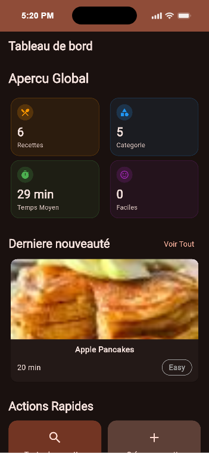
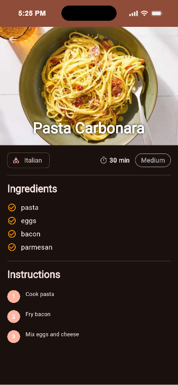
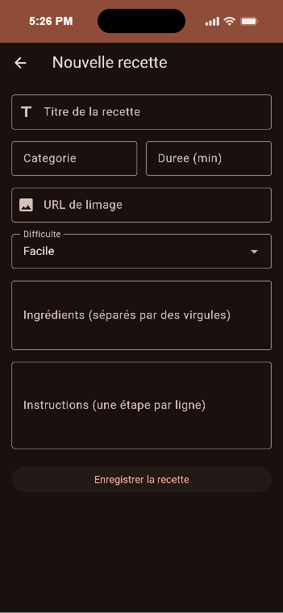

# CulinaryCraft

CulinaryCraft est une application Flutter multiplateforme de gestion et d'exploration de recettes de
cuisine. L'application propose un tableau de bord interactif avec des statistiques calculées en
temps réel, une recherche dynamique, un affichage adaptatif (Mobile / Tablette) et un formulaire de
création de recettes.

## Fonctionnalités

- Tableau de bord : Affichage des indicateurs clés (total des recettes, nombre de catégories, temps
  moyen de préparation, recettes faciles).
- Liste de recettes : Recherche dynamique en temps réel par titre ou catégorie.
- Design responsive : Basculement automatique entre une vue en liste (Mobile) et une vue en grille (
  Tablette).
- Écran de détail : Affichage des informations complètes, de la liste des ingrédients et des
  instructions étape par étape.
- Ajout de recette : Formulaire complet avec validation des champs et formatage automatique des
  données.
- Architecture propre : Séparation claire entre les données (Models/Repositories) et la
  présentation (Screens/Widgets réutilisables).

## Captures d'écran

|             Tableau de bord             |          Liste des recettes           |          Détails de la recette           |          Formulaire d'ajout          |
|:---------------------------------------:|:-------------------------------------:|:----------------------------------------:|:------------------------------------:|
|  |  |  |  |

## Prérequis

- Flutter SDK (version 3.19.0 ou supérieure)
- Dart SDK (version 3.3.0 ou supérieure)
- Android Studio / VS Code avec l'extension Flutter
- Un émulateur ou un appareil physique connecté

## Instructions de lancement

1. Cloner le dépôt Git :
   ```bash
   git clone [https://github.com/votre-nom-utilisateur/culinary_craft.git](https://github.com/votre-nom-utilisateur/culinary_craft.git)
   cd culinary_craft 
   ```

2. Installer les dépendances du projet :

   ```bash
    flutter pub get
   ```

3. Analyser le code pour vérifier l'absence d'erreurs :

   ```bash
    flutter analyze
   ```

4. Lancer l'application :

   ```bash
    flutter run
   ```

## Structure du projet

```Plaintext
lib/
├── data/
│ ├── models/ # Modèle de données (Recipe)
│ └── repositories/ # Gestion et accès aux données (RecipeRepository)
├── presentation/
│ ├── screens/ # Écrans principaux (Dashboard, List, Detail, Add)
│ └── widgets/ # Widgets réutilisables (RecipeCard, CustomSearchBar, DifficultyBadge)
└── routing/ # Navigation et gestion des routes (app_router.dart)
```